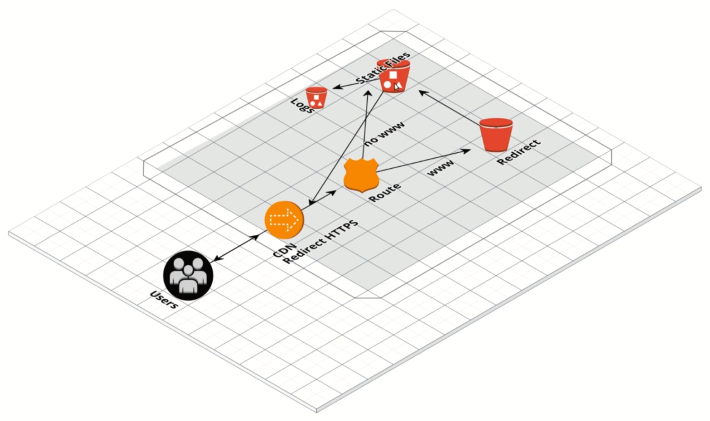

# Static Site

Arquitetura proposta:

Para validar, basta apenas entrar no endereço gerado pelo CloudFront, equivalente ao output *site_domain* da stack do Terraform.

Não foram criados recursos do Route53 e Certificate Manager por questões de custo. Acesso direto via URL do CloudFront.