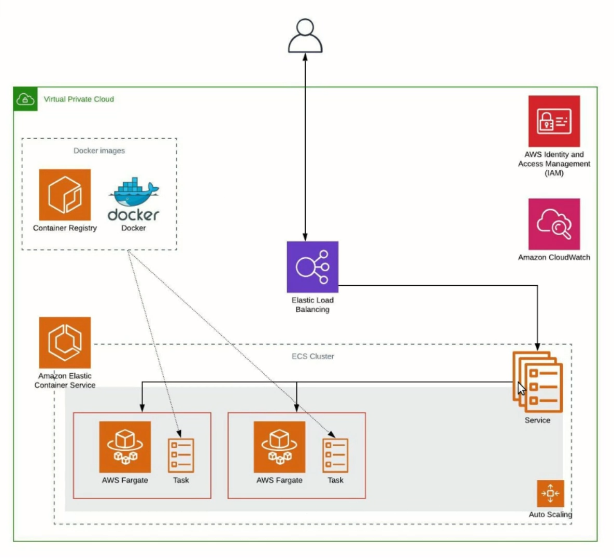

# ECS Application

Arquitetura proposta:


## Terraform Cloud
Para utilizar o Terraform Cloud como backend da stack Terraform, é necessário configurar as credenciais no arquivo *~/.terraformrc* ou, em caso de Windows, *$env:APPDATA/terraform.rc*. Para mais detalhes, conferir na [documentação][cli-configuration-link].

---

## Testando local com Docker
Para executar a aplicação local no Docker, execute os seguintes comandos:
```bash
docker build -t node-app .
docker run -p 8080:3000 <image_id>
```
\* O *image_id* é gerado pelo primeiro comando. 

\* A porta a ser executada pode ser qualquer uma. Optei por usar a 8080. 

---

## Deploy automatizado
Foram criados scripts de deploy/destroy da stack, tanto em bash (Linux) quanto batch (Windows). Estão no diretório [terraform/deploy](terraform/deploy).

**Para executar deploy de dentro da pasta do terraform:**
```bash
deploy/bash/deploy.sh <env>
```
ou
```bash
deploy\batch\deploy.bat <env>
```
<br>

**Para executar destroy de dentro da pasta do terraform:**
```bash
deploy/bash/destroy.sh <env>
```
ou
```bash
deploy\batch\destroy.bat <env>
```

<br>

Sendo **\<env\>** um parâmetro opcional, podendo receber o valor **prod** para stack de produção, ou nada para a stack de dev.

[cli-configuration-link]: https://www.terraform.io/docs/commands/cli-config.html